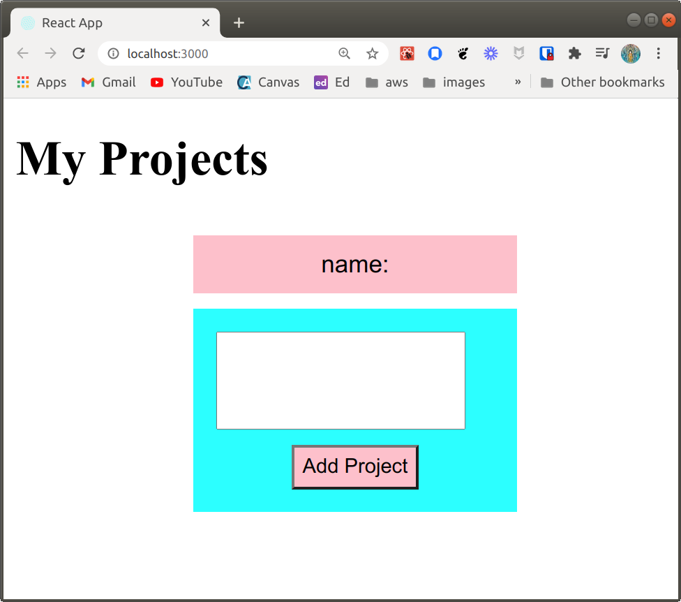
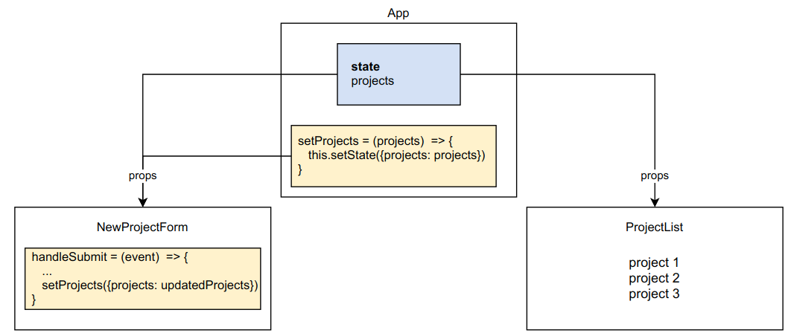

# My Project List

## Setup

1. Make a fork of this repo
2. Clone your fork to your local development environment
3. Change to the project directory
4. Install dependencies: `yarn install`
5. Run the application: `yarn start`
6. Verify the application runs as expected

### What you should see
When you run the application, you should see the following in the browser:

This is a simple application that allows the user to create a list of projects. Simply type a project name into the field and click the Add Project button. The project will appear at the top of a list below the button.

It should behave as shown in [this video link](https://youtu.be/HIIij5J-vNQ). Notice that:
- The text in the pink box with "name:" doesn't change. After completing the first part of the challenge, the value in that box should update with what is typed in the input field (the project name).
- If you don't type anything into the field, it adds an empty element to the list

## Challenge

**Before you begin**

Take some time to understand the existing application. Make sure you understand how we are using state in App to maintain the list of projects that are displayed in ProjectList. Here is a diagram representing the application components:

In this challenge you will practice implementing controlled elements in a form. Controlled elements use component state, which means that any component with controlled elements (or child components) must be class components (or use hooks - we'll learn about that soon).

As the **value** of a controlled element changes (typically with user input), a change listener updates the current value in the *state* of the parent React component.

**Part 1**

In part 1 of the challenge, you will refactor the current code to implement the form in NewProjectForm as a controlled component. This means you will have to:

- Change the way the value of the project name field is managed
- In handleSubmit, use the state value instead of the value from the target to update the list of projects maintained in the App component state

**Part 2**

In part 2 of the challenge, you will add another controlled element to the form for the project description.

You will have to:

- Add the input element in NewProjectForm, and an additional piece of state to track the description value
- Add a change handler function for the description field - you can add a separate handler function, or work out how you could use the same function
- In the handleSubmit function, make a change to add the description to the project that is added to the array in App state
- Update ProjectList to display the description with the project name

**Part 3** 

In the last part of the challenge, we will revisit conditional rendering. 
If Add Project is clicked and no name is given, display a warning message that says "You must enter a project name".

To do this, you will have to:
- Add another piece of state to NewProjectForm for the warning
- Add conditional rendering to the JSX element rendered to display the warning when appropriate
 
Make sure you consult the value in state (not in the DOM) to determine when to display a warning.

**Completed challenge**

When you have completed the challenge, the behaviour should resemble what you see [in this video](https://youtu.be/XzD7Qff9HSQ).

## Tests and Submitting

At any time you can run `yarn test` to see your progress. By default it will run in `watch` mode, and you will have to press `q` to quit. It will run the automated tests against your code and let you know what your progress is so far. Once you have all the tests passing, you can submit your challenge. To do this make sure you have committed your work:

1. From the project root `git add .` and add all the files changed in this folder
2. Commit these files to your repository `git commit -m "challenge completed"`
3. Make sure your working tree is clear `git status`
4. Push these files to your github repository (master or main branch) `git push origin master`
5. Log on to Github and visit your fork of this challenge.
6. Make a pull request to the main branch.
7. Wait and watch the final tests run, if you are successful it will automatically let your educators know you are finished.

## Example solution

An example solution can be found in the challenge-complete branch of this repository.